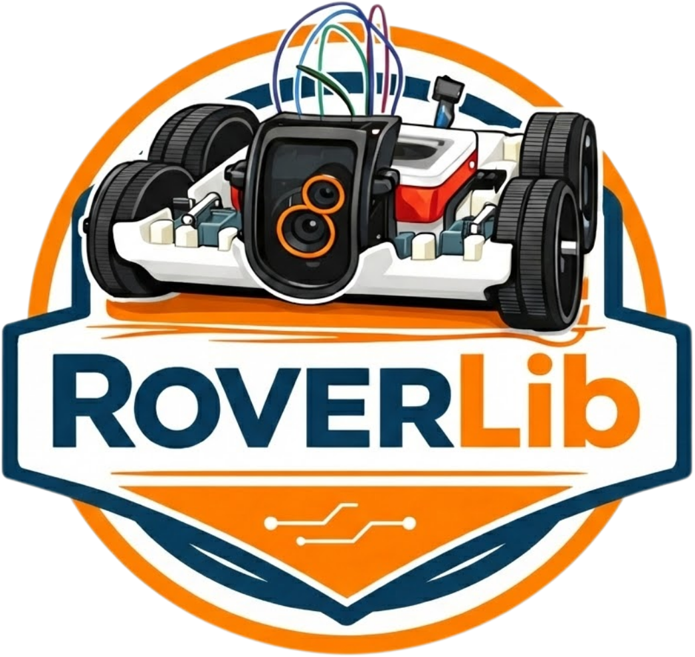

# Roverlib: Biblioteca de Robótica Autônoma em Python
<p align="center">


  
## Apresentação

O **Rover** é uma biblioteca para robótica de código aberto baseada em **Raspberry Pi 5**, projetada para implementar arquiteturas inovadoras a partir de uma abordagem totalmente modular em Python, com suporte a visão computacional híbrida e controle de motores DC em tempo real.

---

## Características

- **Arquitetura Modular em Python:** Separação clara entre drivers, comportamento e inteligência.
- **Visão Computacional Clássica:** Algoritmos otimizados (Hough, Canny, HSV).
- **Line-Following com PID:** Algoritmo de controle proporcional simplificado com detecção de obstáculos.
- **Compatibilidade Multiplataforma:** Fallback automático para câmera mock, permitindo desenvolvimento em PC.

---

## Requisitos de Hardware

### Stack da Equipe de desenvolvimento
- **Raspberry Pi 5 Model B** (8 GB RAM recomendado)
- **Câmera Picamera2** (ou webcam USB como fallback)
- **Ponte-H L298N** para controle de motores DC
- **Bateria/Fonte:** 12V para motores, 5V para RPi

### Hardware para Testes (PC)
- Qualquer PC com Linux/macOS/Windows
- Câmera integrada ou USB

---

## Instalação Rápida

### Pré-requisitos
```bash
python --version  # Python 3.9+  (Conforme pyproject.toml)
pip --version     # pip 22.0+
```

### Passos de Instalação

A biblioteca `roverlib` foi disponibilizada via gerenciador de pacotes, então você não precisa clonar este repositório para testá-la.

1. **Instale a biblioteca diretamente do PyPI:**
```bash
pip install roverlib[cli]
```

2. **Verifique instalação (CLI disponível):**
```bash
rover hello
```

*(Opcional) Para desenvolvimento local, basta clonar o repositório e executar `pip install -e .[cli,dev]` na pasta `roverlib/`.*

---

## Configuração

### Para Raspberry Pi 5

#### 1. Habilitação da Câmera Picamera2

```bash
# No RPi, execute:
sudo raspi-config
# Navegue: Interfacing Options → Camera → Enable
```

#### 2. Configuração de Pinos GPIO

Edite `lib_rover/rover_lib/configs/config.yaml`:

```yaml
gpio:
  motor_esquerdo: [17, 27]    # [pino_direção, pino_PWM]
  motor_direito: [22, 23]

camera:
  resolution: [640, 480]
  fps: 30
  preview_resolution: [320, 240]
```

**Verificação de pinos:** Consulte diagrama GPIO da RPi 5. Os pinos padrão (17, 22, 23, 27) são válidos para modelos B comuns.

#### 3. Permissões de GPIO

```bash
sudo usermod -a -G gpio $USER
# Logout e login para aplicar mudanças
```

### Para Desenvolvimento em PC

Não é necessária configuração adicional. O sistema detecta automaticamente a ausência de drivers de RPi e utiliza motores virtuais (mock).

```bash
# Teste via CLI:
rover new teste_pc
rover run teste_pc
```

---

## Utilização

Os exemplos a seguir detalham o uso programático da biblioteca. Através da CLI (`rover new meu_projeto`), arquivos básicos serão gerados, bastando adaptá-los.

### Exemplo Básico: Avanço Simples

```python
from roverlib.modules.movement.robot import Robot

def main():
    # Inicializa os controladores dos motores (usará motor virtual em PC)
    robot = Robot(left=(17, 27), right=(22, 23))

    # Move para frente por 3 segundos a velocidade 50
    robot.forward(speed=50, duration=3.0)

    robot.cleanup()

if __name__ == "__main__":
    main()
```

### Exemplo: Capturando Imagem (Webcam em PC/PiCamera2 na RPi)

```python
from roverlib.plugins.camera.webcam import Webcam

def main():
    # Inicia a captura da webcam (em PC ou USB)
    cam = Webcam(height=480, width=640)
    frame = cam.get_frame()
    
    if frame is not None:
        print("Quadro capturado com sucesso!")
        
    cam.cleanup()

if __name__ == "__main__":
    main()
```

---

## Estrutura de Diretórios

```markdown
Rover/
├── roverlib/
│   ├── pyproject.toml                 # Definições da biblioteca e plugins
│   └── src/
│       └── roverlib/
│           ├── cli/                   # Interface de linha de comando (CLI)
│           ├── core/                  # Execução e instanciação lógica de projetos
│           ├── modules/               # Módulos abstratos (movement, vision, processing)
│           ├── plugins/               # Drivers de Hardware (camera, motor, lidar)
│           ├── templates/             # Instruções pré-definidas para o comando 'new' do cli (ex: FollowCircle, LineDetect)
│           └── utils/                 # Ferramentas auxiliares
│
├── examples/
│   ├── circleDetect/                  # Exemplo: detecção de círculos
│   ├── roverTkControl/                # Exemplo: interface Tkinter de controle
│   └── ...
│
├── scripts_tests/
│   ├── camera/                        # Scripts de teste de câmera
│   ├── motor/                         # Scripts de teste de motores
│   └── object_detection/              # Testes de detecção (Hough, etc.)
│
├── docs/                              # Documentação Markdown
│   ├── index.md                       # Página inicial
│   ├── arquitetura.md                 # Documentação de arquitetura
│   └── api/
│       └── drivers.md                 # Referência de API
│
├── mkdocs.yml                         # Configuração de documentação
└── README.md                          # Este arquivo
```

---

## Exemplos de Uso

### Exemplo 1: Detecção de Círculos com Visualização

```bash
cd Rover/examples/circleDetect
python main.py
```

**O que acontece:**
- Câmera captura frames contínuos.
- Algoritmo de Hough detecta círculos.
- Visualiza círculos com marcadores (centro, raio).
- Imprime coordenadas na terminal.

### Exemplo 2: Interface Gráfica de Controle

```bash
cd Rover/examples/roverTkControl
python main.py
```

**Funcionalidade:**
- Botões de direção (↑ frente, ↓ trás, ← esquerda, → direita).
- Slider de velocidade (0–100%).
- Exibição de estado atual (velocidade, direção).

### Exemplo 3: Teste de Hough em Tempo Real

```bash
python Rover/scripts_tests/object_detection/HoughTransform/realTime/grayScale.py
```

**Parâmetros ajustáveis:**
```python
main(h=680, w=480, minDist=40, minRadius=10, maxRadius=120)
```

---

## Dependências


Instale os essenciais acessando o arquivo `pyproject.toml`:
```
numpy             # Álgebra linear
opencv-python     # Visão computacional (Hough, Canny, etc.)
click             # Para a CLI "rover"
PyYAML            # Carregamento de configuração
```

**Dependências de Hardware (RPi):**
- `rpi.gpio`, `gpiozero`, `picamera2`

**Dependências opcionais:**
- `mkdocs-material`: Para compilar documentação localmente (`mkdocs serve`).
- `ultralytics`: Para integração com YOLO (detecção avançada).
- `pytest`, `black`, `ruff`: Para ambiente de desenvolvimento (`pip install -e .[dev]`).

---

## Troubleshooting

### Problema: "ModuleNotFoundError: No module named 'picamera2'"

**Solução:** O sistema usa automaticamente câmera mock. Este aviso é esperado em PC. Se estiver em RPi, execute:

```bash
sudo apt-get install -y python3-picamera2
```

### Problema: "PermissionError: GPIO requires root privileges"

**Solução:** Adicione o usuário ao grupo `gpio`:

```bash
sudo usermod -a -G gpio $USER
# Logout e login
```

### Problema: Motores não se movem

**Verificação:**
1. Confirme pinos em `config.yaml` (usar `gpio readall` para visualizar pinagem).
2. Teste manualmente com `gpiozero`:
```python
from gpiozero import Motor
motor = Motor(forward=17, backward=27)
motor.forward()
```
3. Verifique alimentação da ponte-H (12V).

### Problema: Câmera retorna gradiente cinzento

**Motivo:** Sistema está usando câmera mock (esperado em PC).

**Para RPi:** Confirme câmera conectada com `libcamera-hello --list-cameras`.

---

## Documentação Completa

Consulte a documentação online ou localmente:


**Seções de documentação:**
- [Visão Geral](docs/index.md)
- [Arquitetura](docs/arquitetura.md)
- [API da Classe Rover](docs/api/rover.md)
- [Módulos de Hardware](docs/api/drivers.md)


---

## Contribuições

Contribuições são bem-vindas. Para reportar bugs ou sugerir features, abra uma issue no repositório.

---

## Referências e Recursos

- [Raspberry Pi 5 Documentation](https://www.raspberrypi.com/documentation/computers/raspberry-pi.html)
- [OpenCV Tutorials](https://docs.opencv.org/)
- [Hough Transform (Wikipedia)](https://en.wikipedia.org/wiki/Hough_transform)
