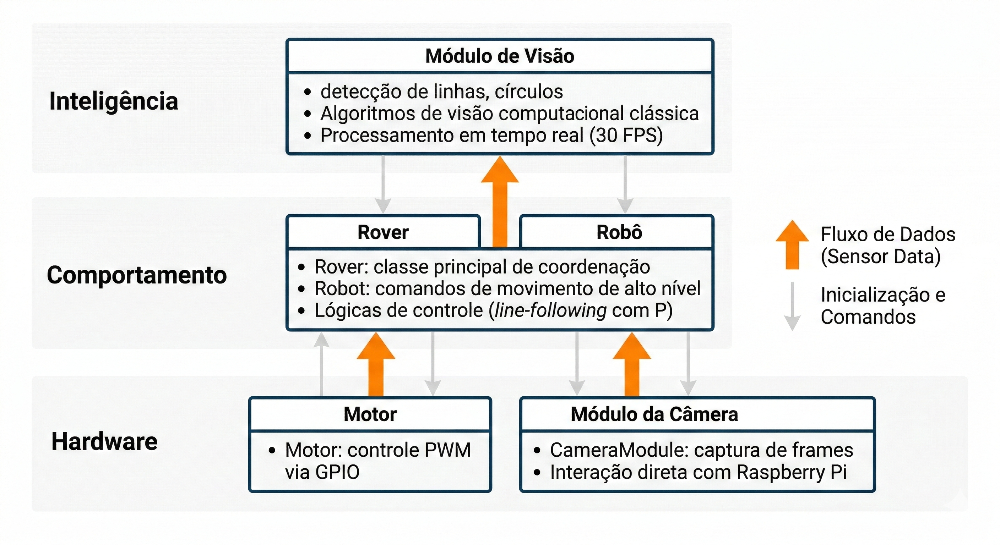
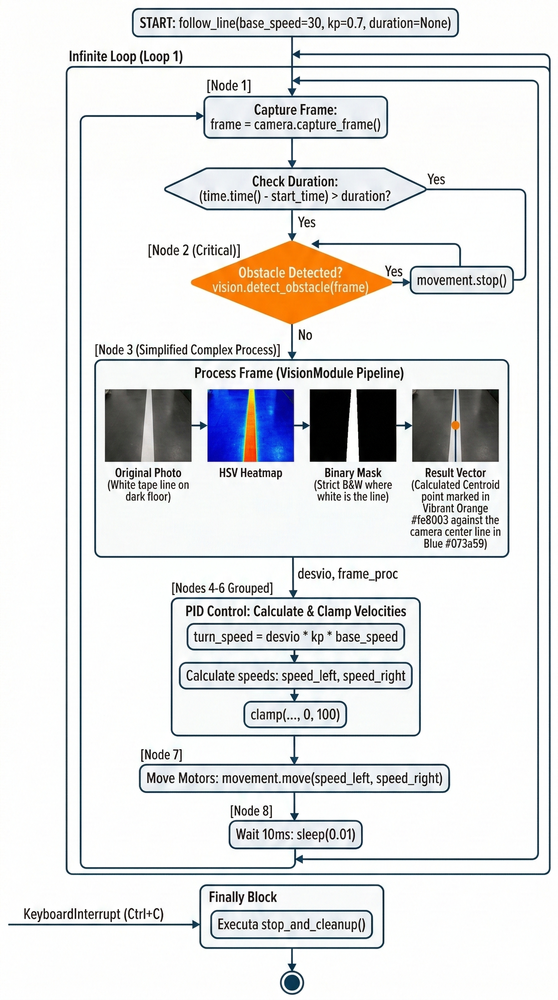
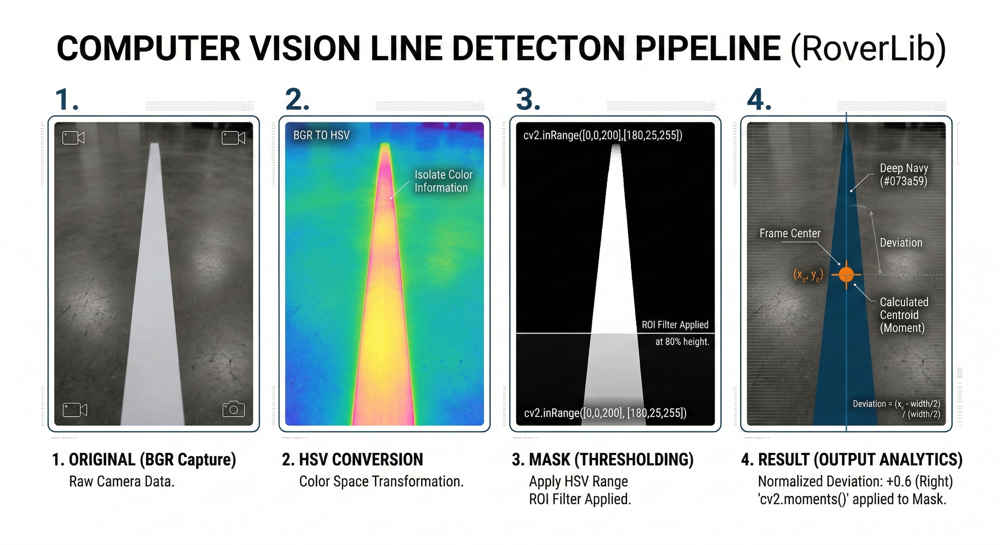

# Arquitetura do Sistema Rover

## Visão Geral

O sistema Rover é uma plataforma robótica modular em Python implementada para Raspberry Pi 5, arquitetada em três camadas funcionais que separam claramente as responsabilidades entre hardware, lógica comportamental e processamento de inteligência visual. Esta separação de responsabilidades (separation of concerns) facilita a manutenção, testes unitários e permite que desenvolvedores e sistemas de alto nível arquitetem lógicas previsíveis e corretas. A biblioteca exporta uma interface simplificada através da classe `Rover`, que orquestra a inicialização e coordenação de todos os módulos subordinados.

### Estrutura em Camadas

A arquitetura em camadas do Rover segue o padrão de abstração crescente, onde cada camada encapsula um domínio específico e expõe interfaces bem definidas para a camada superior.



---

## Camada 1: Drivers de Hardware

Esta camada fornece abstração direta sobre os componentes eletrônicos da Raspberry Pi, encapsulando a complexidade dos protocolos GPIO, PWM e captura de câmera.

### 1.1 Controle de Motores DC

**Arquivo:** [roverlib/src/roverlib/modules/movement/motor.py](../roverlib/src/roverlib/modules/movement/motor.py)

A classe `Motor` fornece controle de baixo nível para um único motor DC acoplado a uma ponte-H L298N (H-bridge). Gerencia diretamente os sinais GPIO e os sinais PWM (Pulse Width Modulation) que determinam a velocidade de rotação.

#### Inicialização e Configuração

```python
from roverlib.modules.movement.motor import Motor

# Criar instância do motor com pinos GPIO
motor = Motor(pins=(12, 11), pwm_frequency=1000)

# Configurar os pinos GPIO e iniciar PWM
motor.initialize()

# Executar movimento
motor.set_movement(speed=75, direction="FORWARD")
```

#### Parâmetros e Comportamento

- **`pins` (tupla de inteiros):** Dois pinos GPIO que controlam as entradas IN1 e IN2 da ponte-H. A ponte-H recebe um par de sinais lógicos que determinam a polaridade da tensão aplicada ao motor (favorecendo rotação em um sentido ou outro).

- **`pwm_frequency` (inteiro, padrão: 1000 Hz):** Frequência de modulação por largura de pulso. Valores típicos variam entre 500 Hz e 2000 Hz. Frequências maiores reduzem ruído audível mas aumentam consumo de CPU.

- **`speed` (float, intervalo 0–100):** Percentual do ciclo de trabalho (duty cycle) do sinal PWM. Valor 0 representa motor parado; valor 100 representa máxima velocidade. A relação entre duty cycle e velocidade linear é aproximadamente proporcional.

- **`direction` (string):** Especifica o sentido de rotação. Valores aceitos: `"FORWARD"` e `"BACKWARD"` (case-insensitive).

#### Gestão de Ciclo de Vida

O método `initialize()` deve ser invocado antes de qualquer chamada a `set_movement()`. A inicialização configura os pinos em modo de saída (GPIO.OUT), cria os objetos PWM nas frequências especificadas e inicia o duty cycle em 0%. Seu estado é rastreado pela flag interna `_initialized`.

Ao término da aplicação, o método `cleanup()` deve ser invocado para liberar recursos GPIO e evitar corrupção de estado do sistema operacional.

#### Tratamento de Erros

A classe `Motor` lança três exceções especializadas definidas em `execeptions/motorExeceptions.py`:

- **`MotorCreationError`:** Levantada se `RPi.GPIO` não estiver disponível (não executando em Raspberry Pi).
- **`UninitializedMotorError`:** Levantada se `set_movement()` for invocado antes de `initialize()`.
- **`DirectionInvalidMotorError`:** Levantada se um valor inválido for passado para o parâmetro `direction`.

### 1.2 Captura de Câmera

**Arquivo:** [roverlib/src/roverlib/modules/camera/cameraModule.py](../roverlib/src/roverlib/modules/camera/cameraModule.py)

A classe `CameraModule` abstrai a captura de frames de câmera, fornecendo suporte automático para hardware Picamera2 (nativo de Raspberry Pi 5) e fallback para mock em plataformas de desenvolvimento que carecem do hardware.

#### Inicialização

```python
from roverlib.modules.camera.cameraModule import CameraModule

# Criar instância da câmera
camera = CameraModule(height=480, width=640, analogic=1.5, exposure=30000)

# Capturar um frame
frame = camera.get_frame()

# Obter resolução de preview
resolution = camera.get_preview_resolution()

# Liberar recursos
camera.cleanup()
```

#### Detecção Automática de Plataforma

O módulo implementa um padrão de detecção dinâmica:

1. **Na Raspberry Pi 5:** Importa `picamera2` com sucesso. O modo de configuração é `preview` em RGB888, com resolução configurável e suporte a controle de ganho analógico e tempo de exposição.

2. **Em plataformas sem Picamera2:** Uma classe mock é instanciada, que retorna frames de teste (gradiente cinza) com dimensões configuráveis. Útil para desenvolvimento e testes em estações de trabalho.

A variável de flag `is_mock` permite código condicional para comportamentos específicos de plataforma.

#### Configuração de Câmera

Os parâmetros de captura são carregados do arquivo [roverlib/src/roverlib/configs/config.yaml](../roverlib/src/roverlib/configs/config.yaml):

```yaml
camera:
  fps: 30                          # Taxa de captura em frames por segundo
  resolution: [3280, 2464]         # Resolução total do sensor
  preview_resolution: [640, 480]   # Resolução de processamento
```

Os parâmetros `analogic` e `exposure` ajustam características de iluminação:

- **`analogic` (float, típico 1.0–4.0):** Amplificação analógica do sensor. Valores menores escurecem a imagem; valores maiores a iluminam (com aumento de ruído).

- **`exposure` (inteiro em microssegundos):** Tempo de exposição do sensor. Valores menores produzem imagens mais escuras; valores maiores capturam mais luz.

#### Formato de Retorno

O método `get_frame()` retorna um array NumPy em formato BGR (Blue-Green-Red), compatível com OpenCV. A conversão automática de RGB (capturado pela câmera) para BGR é realizada internamente.

---

## Camada 2: Comportamento (Orquestração e Movimento)

Esta camada implementa abstrações de alto nível que coordenam motores e sensores para realizar tarefas compostas, como seguir linhas ou executar movimentos estruturados.

### 2.1 Classe Robot

**Arquivo:** [roverlib/src/roverlib/modules/movement/robot.py](../roverlib/src/roverlib/modules/movement/robot.py)

A classe `Robot` encapsula a coordenação de dois motores (esquerdo e direito) para produzir movimentos de alto nível como avanço, recuo e rotações.

#### Inicialização

```python
from roverlib.modules.movement.robot import Robot

# Criar instância com pinos dos motores
robot = Robot(
    left=(12, 11),      # Pinos do motor esquerdo (direção, PWM)
    right=(22, 23),     # Pinos do motor direito (direção, PWM)
    pwm_frequency=1000  # Frequência em Hz
)

# Agora os motores estão configurados e prontos
```

#### Métodos de Movimento

Todos os métodos de movimento aceitam parâmetros opcionais de duração que, quando definidos, fazem o robô executar o movimento por um tempo determinado antes de parar automaticamente.

**`forward(speed=50, duration=None) → bool`**

Move o robô para frente aplicando a velocidade especificada em ambos os motores com polaridade idêntica.

```python
# Movimento indefinido
robot.forward(speed=60)

# Movimento de 2 segundos
robot.forward(speed=60, duration=2.0)
```

**`backward(speed=50, duration=None) → bool`**

Move o robô para trás invertendo a polaridade em ambos os motores.

```python
robot.backward(speed=50, duration=1.5)
```

**`turn_left(speed=50, duration=None) → bool`**

Gira o robô no sentido anti-horário. O motor esquerdo é parado enquanto o direito avança, produzindo rotação in situ.

```python
robot.turn_left(speed=50, duration=1.0)
```

**`turn_right(speed=50, duration=None) → bool`**

Gira o robô no sentido horário. O motor direito é parado enquanto o esquerdo avança.

```python
robot.turn_right(speed=50, duration=1.0)
```

**`move(speed_left, speed_right) → None`**

Aplica velocidades independentes a cada motor, permitindo movimentos curvos e manobras complexas.

```python
# Curva suave para esquerda
robot.move(speed_left=40, speed_right=60)

# Aproximação de rotação diferencial
robot.move(speed_left=60, speed_right=40)
```

**`stop() → None`**

Para ambos os motores imediatamente.

**`cleanup() → None`**

Libera todos os recursos GPIO associados aos motores.

#### Calibração de Motores

O módulo [roverlib/src/roverlib/modules/movement/motorCalibration.py](../roverlib/src/roverlib/modules/movement/motorCalibration.py) implementa compensação de assimetrias mecânicas. Em robôs reais, diferenças nas resistências de atrito, enrolamento de bobina e engrenagens causam que, quando aplicada a mesma velocidade, o robô desvie para um lado.

A classe `MotorCalibration` carrega fatores de compensação do arquivo `config.yaml`:

```yaml
motor_calibration:
  limiar_motor_esquerdo: 1.0  # Fator multiplicativo de velocidade
  limiar_motor_direito: 1.0   # Fator multiplicativo de velocidade
```

Valores acima de 1.0 aumentam a velocidade do motor especificado; valores abaixo reduzem.

### 2.2 Classe Rover (Orquestrador Principal)

**Arquivo:** [roverlib/src/roverlib/rover.py](../roverlib/src/roverlib/rover.py)

A classe `Rover` é o ponto de entrada da biblioteca. Inicializa todos os módulos e fornece métodos de alto nível para tarefas robóticas complexas como line-following.

#### Inicialização

```python
from roverlib import Rover

# Instanciar o Rover
rover = Rover(pwm_frequency=1000)

# A instância agora possui três atributos públicos:
# - rover.movement (instância de Robot)
# - rover.camera (instância de CameraModule)
# - rover.vision (instância de VisionModule)
```

Durante a inicialização:

1. `Config.get("gpio")` carrega a configuração de pinos do arquivo `config.yaml`.
2. Instâncias de `Robot`, `CameraModule` e `VisionModule` são criadas.
3. Mensagens de diagnóstico são impressas no console.

#### Método Principal: Line-Following

**`follow_line(base_speed=30, kp=0.7, max_turn_speed=25, duration=None) → None`**

Este método implementa um algoritmo de seguimento de linha usando controle proporcional (P). O robô executa um loop de tempo real que:

1. Captura frame da câmera
2. Detecta obstáculos (prioridade máxima)
3. Processa o frame para extrair desvio da linha
4. Aplica controle proporcional para corrigir trajetória
5. Aguarda 10 ms antes da próxima iteração

```python
rover = Rover()

try:
    # Seguir linha indefinidamente
    rover.follow_line(base_speed=30, kp=0.7)
except KeyboardInterrupt:
    print("Interrupção do usuário.")
finally:
    rover.stop_and_cleanup()
```

##### Parâmetros

- **`base_speed` (inteiro, 0–100):** Velocidade de cruzeiro em percentual. Aplicada simetricamente a ambos os motores quando nenhuma correção é necessária.

- **`kp` (float):** Ganho proporcional do controlador. Determina a magnitude da correção. Valores típicos: 0.5–1.0. Valores maiores produzem resposta mais agressiva (oscilar).

- **`max_turn_speed` (inteiro):** Limite máximo de velocidade de correção de curva. Evita que o robô execute manobras muito bruscas.

- **`duration` (float, opcional):** Duração máxima de execução em segundos. Se `None`, executa indefinidamente até interrupção por teclado.

##### Fluxo de Execução



##### Tratamento de Obstáculos

Obstáculos detectados (cor vermelha por padrão) interrompem o movimento imediatamente. O algoritmo retorna ao início do loop para reavaliar após pequeno atraso (0.5 s) para estabilização.

##### Método de Finalização

**`stop_and_cleanup() → None`**

Para ambos os motores, libera recursos GPIO, fecha streams de câmera e imprime mensagem de confirmação. Deve sempre ser invocado ao término, tipicamente em bloco `finally`.

```python
rover = Rover()
try:
    rover.follow_line(base_speed=30, duration=5.0)
finally:
    rover.stop_and_cleanup()  # Sempre executado
```

---

## Camada 3: Inteligência (Processamento de Imagem)

Esta camada implementa algoritmos de visão computacional clássica para extração de features e detecção de formas.

### 3.1 Módulo de Visão

**Arquivo:** [roverlib/src/roverlib/modules/vision/visionModule.py](../roverlib/src/roverlib/modules/vision/visionModule.py)

O `VisionModule` processa frames capturados pela câmera, detectando linhas, círculos e obstáculos através de algoritmos consolidados de visão computacional.

#### Inicialização

```python
from roverlib.modules.vision.visionModule import VisionModule

# Criar instância com resolução esperada de frames
vision = VisionModule(resolution=(640, 480))
```

A resolução deve corresponder à resolução de frames que serão processados. Utilizada internamente para cálculos de normalização e centroide.

#### Detecção de Linhas para Line-Following

**`process_frame_for_line_following(frame) → tuple[float, np.ndarray]`**

Processa um frame para detectar uma linha branca (ou clara) contra fundo mais escuro, calculando o desvio do centroide da linha em relação ao centro horizontal do frame.

##### Algoritmo

1. **Conversão de Espaço de Cor:** Converte de BGR para HSV (Hue, Saturation, Value). O espaço HSV é mais robusto para detecção de cores em variações de iluminação.

2. **Máscara de Cor:** Aplica `cv2.inRange()` com limites HSV para isolamento da cor branca:
   - Lower: `[0, 0, 200]` (baixa saturação, alto valor)
   - Upper: `[180, 25, 255]` (baixa saturação, alto valor)

3. **Região de Interesse (ROI):** Anula pixels acima de 80% da altura (ROI a partir de `0.8 * height`), focando na detecção perto do robô.

4. **Cálculo de Centroide:** Utiliza momentos de imagem (`cv2.moments()`) para calcular o centroide $(x_c, y_c)$ da máscara:
   $$M = \int\int I(x,y) \, dx \, dy$$
   $$x_c = \frac{M_{10}}{M_{00}}, \quad y_c = \frac{M_{01}}{M_{00}}$$

5. **Normalização de Desvio:** Calcula o deslocamento em relação ao centro:
   $$\text{desvio} = \frac{x_c - \frac{\text{width}}{2}}{\frac{\text{width}}{2}}$$

   Resultado: valor entre -1.0 (totalmente esquerda) e 1.0 (totalmente direita).

##### Exemplo de Uso

```python
frame = camera.capture_frame()
desvio, frame_processado = vision.process_frame_for_line_following(frame)

print(f"Desvio da linha: {desvio:.2f}")  # Entre -1.0 e 1.0

# frame_processado contém visualizações para debug (centroide, linha central, valor de desvio)
```



#### Detecção de Círculos

**`houghCircleDetect(img, dp=1.3, minDist=50, canny=100, accumulation=40, minRadius=5, maxRadius=300) → tuple[tuple, np.ndarray]`**

Localiza círculos em uma imagem usando Transformada de Hough circular. Este é um método clássico e robusto para detecção de formas circulares.

##### Algoritmo

1. **Detecção de Bordas:** Aplica filtro de arestas (Canny) via `ProcessingImage.edge_filter()`.

2. **Máscaras Morfológicas:** Aplica operação de fechamento (MORPH_CLOSE) com kernel elíptico para preencher pequenos vãos e fortalecer bordas elípticas.

3. **Transformada de Hough:** Utiliza `cv2.HoughCircles()` com parâmetros:
   - `dp`: Razão de resolução do acumulador (1.3 = reduzida para rapidez).
   - `minDist`: Distância mínima entre centros de círculos (evita duplicatas).
   - `param1` (canny): Limiar superior para Canny (usado na detecção de bordas interna).
   - `param2` (accumulation): Limiar do acumulador de Hough.
   - `minRadius` e `maxRadius`: Limites de raio esperado.

4. **Seleção do Maior Círculo:** Ordena círculos por raio decrescente e retorna o primeiro (maior).

##### Parâmetros

- **`dp` (float):** Razão inversa de acumulação de resolução. Valores menores (p.ex., 1.0) preservam resolução mas aumentam custo computacional. Padrão 1.3 oferece bom balanço.

- **`minDist` (inteiro):** Distância mínima entre centros (em pixels). Para câmera 640×480, tipicamente 40–60.

- **`canny` (inteiro):** Limiar para Canny. Valores maiores exigem bordas mais proeminentes.

- **`accumulation` (inteiro):** Votação mínima no acumulador de Hough. Valores maiores reduzem falsos positivos.

- **`minRadius` e `maxRadius` (inteiros):** Intervalo de raios esperados.

##### Retorno

Tupla `(círculo, máscara_bordas)`:
- **círculo:** Tupla `(x, y, raio)` do círculo detectado, ou `None` se nenhum encontrado.
- **máscara_bordas:** Array NumPy com bordas detectadas, útil para visualização.

##### Exemplo

```python
frame = camera.capture_frame()
circulo, bordas = vision.houghCircleDetect(
    frame,
    dp=1.3,
    minDist=50,
    canny=100,
    accumulation=40,
    minRadius=5,
    maxRadius=300
)

if circulo:
    x, y, r = circulo
    print(f"Círculo detectado: centro=({x}, {y}), raio={r}")
else:
    print("Nenhum círculo detectado.")
```

#### Detecção de Círculos Alternativa (Contornos)

**`circleCannyDetect(img, MINRADIUS=3, MINAREA=300, canny=(70, 150)) → tuple | None`**

Detecta círculos alternativamente via contornos e coeficiente de circularidade, útil para robustez em condições onde a Transformada de Hough falha.

##### Algoritmo

1. **Detecção de Arestas:** Aplica Canny com limiares especificados.

2. **Extração de Contornos:** `cv2.findContours()` localiza todos os contornos.

3. **Filtragem por Área:** Descarta contornos com área menor que `MINAREA`.

4. **Cálculo de Circularidade:** Para cada contorno:
   - Encontra o círculo envolvente mínimo via `cv2.minEnclosingCircle()`.
   - Calcula razão de erro:
     $$\text{erro} = \frac{|\text{área}_{contorno} - \text{área}_{círculo}|}{\text{área}_{círculo}}$$
   - Contornos com `erro < 0.35` são considerados circulares.

5. **Seleção do Melhor:** Retorna o círculo com menor erro.

##### Exemplo

```python
frame = camera.capture_frame()
circulo = vision.circleCannyDetect(frame, MINRADIUS=3, MINAREA=300)

if circulo:
    x, y, r = circulo
    print(f"Círculo encontrado: ({x}, {y}), raio={r}")
```

#### Detecção de Obstáculos

**`detect_obstacle(frame, min_area_threshold=5000, color_range=None) → tuple[bool, np.ndarray]`**

Detecta a presença de obstáculos (tipicamente vermelhos) na frente do robô baseado em cor e área.

##### Parâmetros

- **`frame`:** Array NumPy em BGR.
- **`min_area_threshold`:** Área mínima em pixels para considerar um objeto como obstáculo.
- **`color_range`:** Tupla `(lower_hsv, upper_hsv)` para intervalo de cores. Padrão: vermelho.

##### Retorno

Tupla `(detectado, máscara)`:
- **detectado:** Boolean indicando presença de obstáculo.
- **máscara:** Array com máscara binária do obstáculo.

##### Exemplo

```python
frame = camera.capture_frame()
obstáculo_detectado, máscara = vision.detect_obstacle(frame, min_area_threshold=5000)

if obstáculo_detectado:
    print("Obstáculo na frente!")
```

---

## Fluxo de Dados Integrado

### Diagrama de Fluxo (Line-Following)

A sequência a seguir ilustra como dados fluem através das três camadas durante uma iteração de line-following:

```
┌─────────────────────────────────────────────────────────┐
│ Iteração N do Loop de Controle (10 ms)                  │
└─────────────────────────────────────────────────────────┘
                          ↓
        ┌─────────────────────────────────────┐
        │ 1. Captura de Frame (Câmera)        │
        │ camera.capture_frame() → frame      │
        └─────────────────────────────────────┘
                          ↓
        ┌─────────────────────────────────────┐
        │ 2. Detecção de Obstáculos (Visão)   │
        │ vision.detect_obstacle(frame)       │
        │ Se detectado → movement.stop()      │
        └─────────────────────────────────────┘
                          ↓
        ┌─────────────────────────────────────┐
        │ 3. Processamento de Linha (Visão)   │
        │ vision.process_frame_for_...()      │
        │ Retorna desvio normalizado           │
        └─────────────────────────────────────┘
                          ↓
        ┌─────────────────────────────────────┐
        │ 4. Controle Proporcional (Comp.)    │
        │ turn_speed = desvio × kp × base_spd │
        │ speed_left, speed_right = calculado │
        └─────────────────────────────────────┘
                          ↓
        ┌─────────────────────────────────────┐
        │ 5. Comando de Movimento (Robot)     │
        │ movement.move(speed_left,           │
        │              speed_right)           │
        └─────────────────────────────────────┘
                          ↓
        ┌─────────────────────────────────────┐
        │ 6. Controle de Motores (Motor)      │
        │ motor.set_movement(speed,           │
        │                   direction)        │
        │ Escreve nos pinos GPIO/PWM          │
        └─────────────────────────────────────┘
                          ↓
                   sleep(0.01)
                          ↓
                  Próxima Iteração
```

---

## Configuração do Sistema

### Arquivo de Configuração

**Arquivo:** [roverlib/src/roverlib/configs/config.yaml](../roverlib/src/roverlib/configs/config.yaml)

Centraliza todos os parâmetros de hardware e calibração. Carregado automaticamente pela classe `Config` no módulo `utils.config_manager`.

```yaml
gpio:
  motor_esquerdo:
    in1: 12         # Pino de direção
    in2: 11         # Pino de PWM
  motor_direito:
    in3: 15         # Pino de direção
    in4: 16         # Pino de PWM

camera:
  fps: 30                              # Taxa de captura
  resolution: [3280, 2464]             # Resolução máxima do sensor
  preview_resolution: [640, 480]       # Resolução de processamento

motor_calibration:
  limiar_motor_esquerdo: 1.0           # Fator de ganho
  limiar_motor_direito: 1.0            # Fator de ganho
```

**Notas de Configuração:**

- **Resolução de Preview:** Deve corresponder aos valores esperados por `VisionModule`. Maiores resoluções permitem maior acurácia em detecção mas aumentam latência computacional. Para RPi 5, 640×480 é recomendado.

- **FPS da Câmera:** Taxa de captura em quadros por segundo. Valor 30 é padrão para Raspberry Pi 5 com iluminação adequada.

- **Calibração de Motores:** Fator multiplicativo de compensação. Execute [scripts_tests/motor/](../scripts_tests/motor/) para calibração manual se o robô desviar sistematicamente durante movimento reto.

---

## Performance e Limitações

### Características de Tempo Real

- **Período de Loop de Controle:** 10 ms (100 Hz), permitindo resposta rápida a desvios de trajetória.

- **Taxa de Captura:** 30 FPS em Raspberry Pi 5 com iluminação adequada.

- **Latência Total:** Aproximadamente 50–100 ms de captura até efetuação de movimento (somando latência de câmera, processamento e GPIO).

- **Processamento:** Inteiramente em CPU (sem aceleração GPU). Adequado para Raspberry Pi 5 em RPM baixas.

### Restrições Conhecidas

1. **Carga Computacional:** Algoritmos de visão executam em sequência. Reduzir resolução de preview ou complexidade de detecção se FPS cair abaixo de 20.

2. **Calibração de Motores:** Crítica para movimento reto. Diferenças de fabricação causam desvios. Utilizar `motorCalibration.py` ou ajustar manualmente `config.yaml`.

3. **Sensibilidade de Câmera:** Parâmetros de `analogic` e `exposure` devem ser ajustados para condições de iluminação ambiente. Excesso de brilho causa saturação; deficiência causa ruído.

4. **Robustez da Detecção de Linha:** O algoritmo HSV simples é sensível a mudanças de iluminação. Em ambientes muito variáveis, considerar técnicas mais avançadas (p.ex., Canny adaptativo).

5. **Alcance de Visão:** Detecção confiável apenas em distâncias de 10–100 cm da câmera (campo de visão típico).

---

## Integração com LLMs (Code as Policies)

A arquitetura em camadas permite que sistemas de geração de código (Large Language Models) criem scripts robustos através de composição de métodos:

```python
# Exemplo: Script gerado por LLM para tarefa de navegação
from roverlib import Rover
import time

rover = Rover()

try:
    # Fase 1: Avançar 3 segundos
    rover.movement.forward(speed=50, duration=3.0)
    
    # Fase 2: Buscar círculo vermelho
    for _ in range(10):  # Até 10 tentativas
        frame = rover.camera.capture_frame()
        circulo, _ = rover.vision.houghCircleDetect(frame)
        
        if circulo:
            x, y, r = circulo
            print(f"Objeto circular encontrado em ({x}, {y})")
            break
        
        time.sleep(0.1)
    
    # Fase 3: Seguir linha por 5 segundos
    rover.follow_line(base_speed=30, kp=0.7, duration=5.0)

except KeyboardInterrupt:
    print("Interrompido pelo usuário.")
finally:
    rover.stop_and_cleanup()
```

A estrutura bem definida e nomes descritivos facilitam geração automática com baixa taxa de erros.

---

