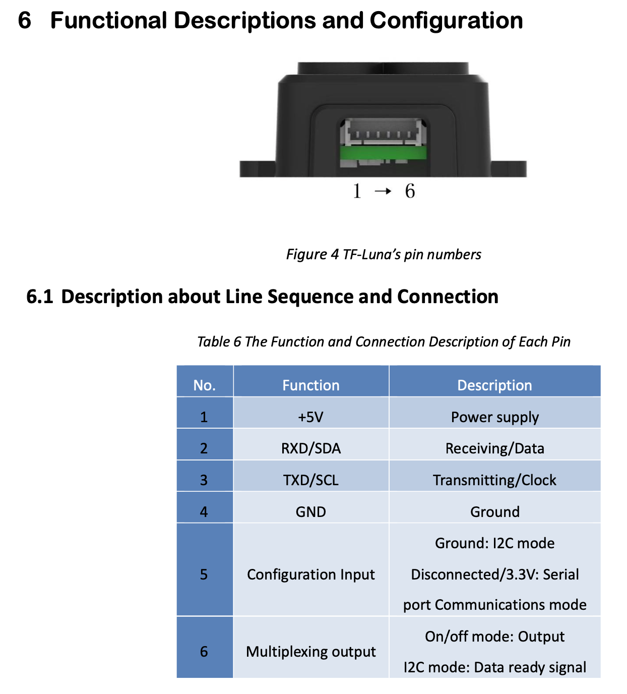

## Documentação Técnica - LIDAR TF-Luna

### 1. Especificações de Operação

O sensor TF-Luna opera utilizando o protocolo UART. Para a prosperidade, as especificações de configuração são:

- **Baud Rate**: 115200 bps

- **Frequência de Saída**: 100 Hz (Padrão do TF-Luna)

- **Estrutura de pacotes**: 9 bytes por leitura.
  - **_Bytes 0 e 1_**: Cabeçalho (0x59 0x59 (Tem que ser esse))

  - **_Bytes 2 e 3_**: Distância em **cm**

  - **_Bytes 4 e 5_**: Força do sinal

  - **_Bytes 6 e 7_**: Temperatura do chip (°C)

  - **_Byte 8_**: Checksum (método de verificação de erros ou "Impressão digital" dos dados)

### 2. Pinout do Lidar:

Com o lidar nessa posição, da direita pra esquerda, 1 -> 6.

- 1. VCC: Qualquer de 5V
- 2. RX/SDA: Pino 8 (GPIO 14)
- 3. TX/SCL: Pino 10 (GPIO 15)
- 4. GND: Qualquer ground
- 5. Input de configuração: Ground == I2C mode / 3.3V Serial mode
- 6. Multiplexing output.

### 3. Biblioteca usada (pySerial)

Para comunicação entre Raspberry Pi 5 e o TF-Luna dos dados lidos pelo Lidar, foi utilizada a biblioteca pySerial.

`pip install serial`

A baixo, teremos as funções utilizadas no script de teste:

- `serial.Serial(port..., baudrate..., timeout...)`: É o construtor. Inicializa a porta física e define as regras de comunicação
  - `Port= '/dev/ttyAMA0'`: Especifica o arquivo de dispositivo que representa os pinos GPIO 14 e 15.

  - `baudrate=115200`: Define a velocidade de sinalização. Ambos os dispositivos devem operar na mesma frequência.

  - `timeout=1`: Define o tempo máximo de espera (em segundos) por um dado antes de retornar None. Isso evita que o script trave no caso de uma remoção de sensor, por exemplo.

- `uart_lidar.in_waiting()`
  - **Função**: Retorna o número de bytes já armazenado no buffer.

  - **Uso no script**: Utilizamos para verificar se há pelo menos 9 bytes (um pacote inteiro) antes de iniciar a leitura dos datos.

- `uart_lidar.read(size)`

  **Função:** Realiza a leitura física.

  **Observação**: É uma estrutura FIFO. Ao fazer .read(1), retiramos o dado mais antigo da fila.

- `uart_lidar.reset_input_buffer()`
  - **Função**: Descarta todos os dados do buffer de input.

  - **Uso no projeto**: Foi usado para "manter o tempo real", eliminando os dados que foram adquiridos, mas ficaram obsoletos pois não foram usados.

- `uart_lidar.write(data)`
  - **Função**: Envia uma sequênca de bytes através do pino TX (GPIO 14)

  - **Observação**: Pode ser usado para definir configurações no TF-Luna, enviando pacotes específicos de acordo com o manual.

- `uart_lidar.close()`
  - **Função**: Encerra corretamente a conexão de hardware, liberando a porta /dev/ttyAMA0

  - **Observação**: Sempre incluir em bloco com um KeyboardInterrupt ou semelhante.

### 4. Problemas com o Buffer Serial (Overflow):

Durante o desenvolvimento do script de testes, foi encontrado um problema crítico no seu uso: **_A velocidade elevada de leitura contra a velocidade de processamento_**

**Análise do problema**:

1. O Lidar envia 900 bytes por segundo (ou 100 Hz \* 9 bytes).

2. Certas libs ou funcionalidades que formos usar esses dados como o Matplotlib podem gerar atraso na renderização ou tratamento desses dados, fazendo com que se acumulem no buffer.

Em resumo, se lermos apenas 9 bytes enquanto o Lidar envia 100, muitas coisas ficaram no passado, atrasando o retorno do Script.

**Solução com gestão de Fluxo (in_wainting)**:

`if uart_lidar.in_waiting > 500:`

Garante que se a quantidade de dados que estiverem esperando forem maior que 500 bytes (valor sugerido), é possível limpar, ou armazenar esses dados sobressalentes, resolvendo o problema de overflow.
